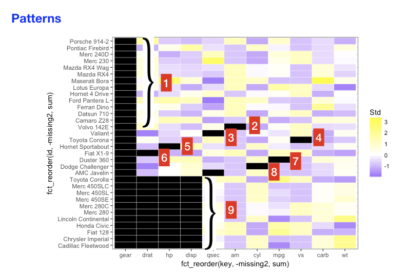

```{r, include = FALSE}
codeversion <- knitr::is_html_output(excludes = "slidy")
knitr::opts_chunk$set(warning = FALSE, message = FALSE,
                      echo = codeversion)
options(scipen = 999)
```


# Row / column missing patterns

> - Do all rows / columns have the same percentage of missing values? 

> - Are there correlations between missing rows / columns? (If a value is missing in one column it is likely to be missing in another column.)

# Sample dataset with missing values

```{r, echo=TRUE}
library(tidyverse)
# Add NAs to mtcars dataset
set.seed(5702)
mycars <- mtcars
mycars[,"gear"] <- NA
mycars[10:20, 3:5] <- NA
for (i in 1:10) mycars[sample(32,1), sample(11,1)] <- NA
```

# Row / column missing patterns

## Missing values by column

```{r, echo = TRUE}
colSums(is.na(mycars)) %>%
  sort(decreasing = TRUE)
```

# Row / column missing patterns

## Missing values by row

```{r, echo = TRUE}
rowSums(is.na(mycars)) %>%
  sort(decreasing = TRUE)
```


# Row / column missing patterns

## heatmap

`geom_tile()`

```{r}
library(tidyverse)

tidycars <- mycars %>% 
    rownames_to_column("id") %>% 
    gather(key, value, -id) %>% 
    mutate(missing = ifelse(is.na(value), "yes", "no"))
```

```{r}
ggplot(tidycars, aes(x = key, y = fct_rev(id), fill = missing)) +
  geom_tile(color = "white") + 
  ggtitle("mtcars with NAs added") +
  scale_fill_viridis_d() + # discrete scale
  theme_bw()
```


# Row / column missing patterns

## heatmap

`mi::missing_data.frame()` 

```{r, echo = TRUE, results = FALSE}
library(mi)
x <- missing_data.frame(mycars)
```

```{r, echo = TRUE}
image(x)
```


(gear not shown since all are missing)

# Row / column missing patterns

## Missing values by variable

`geom_tile()`

```{r}
ggplot(tidycars, aes(x = key, y = fct_rev(id), fill = value)) +
  geom_tile(color = "white") + 
  scale_fill_gradient(low = "grey80", high = "red", na.value = "black") + theme_bw()
```

# Row / column missing patterns

## Missing values by variable

`geom_tile()` with standardized variables

```{r}
tidycars <- tidycars %>% group_by(key) %>% 
  mutate(Std = (value-mean(value, na.rm = TRUE))/sd(value, na.rm = TRUE)) %>% ungroup()

ggplot(tidycars, aes(x = key, y = fct_rev(id), fill = Std)) +
  geom_tile(color = "white") + 
  scale_fill_gradient2(low = "blue", mid = "white", high ="yellow", na.value = "black") + theme_bw()
```

# Row / column missing patterns

## Missing values by variable

reordered by number of missing


```{r}
# convert missing to numeric so it can be summed up
tidycars <- tidycars %>% 
  mutate(missing2 = ifelse(missing == "yes", 1, 0))

ggplot(tidycars, aes(x = fct_reorder(key, -missing2, sum), y = fct_reorder(id, -missing2, sum), fill = Std)) +
  geom_tile(color = "white") + 
  scale_fill_gradient2(low = "blue", mid = "white", high ="yellow", na.value = "black") + theme_bw()
```


# Row / column missing patterns

### Missing values by variable

</img>

# Row / column missing patterns

### Missing values by variable

missing patterns

```{r, echo = TRUE}
x <- mi::missing_data.frame(mycars)
class(x)
x@patterns
levels(x@patterns)
summary(x@patterns)
```

# Aggregated missing patterns

(repeated patterns are reduced to one row)

rows and columns sorted by number missing

```{r, fig.height = 3, echo = TRUE}
library(redav)
plot_missing(mycars, percent = FALSE)
```


# Aggregated missing patterns (percent)

(repeated patterns are reduced to one row)

rows and columns sorted by percent missing

```{r, fig.height = 3, echo = TRUE}
plot_missing(mycars)
```


# NYC School data
```{r}
df <- read.csv("SAT2010.csv", na.strings = "s",
               check.names = FALSE)
head(df)
dim(df)
```


# NYC School data

```{r, fig.height = 3}
df2 <- df
colnames(df2) <- substr(colnames(df2), 1, 8)
plot_missing(df2)
```

# Value patterns in missing data

> - Are missing patterns correlated with values of another variable?

> - Are certain value ranges more likely to be missing? 

> - Or are there no patterns at all? 

> - (An explanation may not be available within the dataset.)

# NYC School data

Does the proportion of schools with missing data vary by borough?

Data: `SAT2010.csv`


```{r}
head(df)
```

# Missing by borough

```{r}
df <- df %>% mutate(Borough = str_sub(DBN, 3, 3))
percent_missing <- df %>% group_by(Borough) %>% 
  summarize(num_schools = n(), num_na = sum(is.na(`Writing Mean`))) %>% 
  mutate(percent_na = round(num_na/num_schools, 2)) %>% 
  arrange(-percent_na)
percent_missing
```


# Missing by borough

K, Q, M, X, R

Manhattan

Brooklyn

Queens

The Bronx

Staten Island

# Missing by borough

K, Q, M, X, R

Manhattan = New York County

Brooklyn  = Kings County

Queens = Queens County

The Bronx = Bronx County

Staten Island = Richmond County


# Missing by borough

K, Q, M, X, R

<span style="color:red">M</span>anhattan = New York County = "M"

Brooklyn = <span style="color:red">K</span>ings County = "K"

<span style="color:red">Q</span>ueens = <span style="color:red">Q</span>ueens County = "Q"

The Bron<span style="color:red">x</span> = Bron<span style="color:red">x</span> County = "X"

Staten Island = <span style="color:red">R</span>ichmond County = "R"

# Missing by borough

```{r}
percent_missing <- percent_missing %>%
  mutate(BoroughName = fct_recode(Borough,
                                      Manhattan = "M",
                                      Brooklyn = "K", 
                                      Queens = "Q", 
                                      `The Bronx` = "X",
                                      `Staten Island` = "R"))
percent_missing

```

# Missing by borough

```{r}
df <- df %>% 
  mutate(BoroughName = fct_recode(Borough, 
                                      Manhattan = "M",
                                      Brooklyn = "K", 
                                      Queens = "Q", 
                                      `The Bronx` = "X",
                                      `Staten Island` = "R"))

dfsum <- df %>% group_by(BoroughName) %>% 
  summarize(Reading = round(mean(`Critical Reading Mean`, na.rm = TRUE), 1), 
            Math = round(mean(`Mathematics Mean`, na.rm = TRUE), 1),
            Writing = round(mean(`Writing Mean`, na.rm = TRUE), 1)) %>%
  left_join(percent_missing %>% select(BoroughName, percent_na), 
            by = "BoroughName") %>% 
  arrange(desc(percent_na))
```

# Missing by borough and scores

```{r}
dfsumtidy <-  dfsum %>% pivot_longer(cols = Reading:Writing, 
                                     names_to = "subject",
                                     values_to = "meanscore")
ggplot(dfsumtidy, aes(meanscore, percent_na, color = BoroughName)) + geom_point(size = 2) + facet_wrap(~subject) + theme_bw() +
  theme(legend.position = "bottom")
```

# EXAMPLE: Snowfall

I need to know how much snow fell *per day* in New York State in February 2017, on a county or more detailed level. I know some government agency measures and reports snowfall and puts the data online. 

# Snowfall

I need to know how much snow fell *per day* in New York State in February 2017, on a county or more detailed level. I know some government agency measures and reports snowfall and puts the data online. 

Source: https://www.ncdc.noaa.gov/snow-and-ice/daily-snow/NY/snowfall/20170201

Accessed: 2017-10-26


#
```{r, eval = TRUE, fig.width = 9}
library(tidyverse)

# https://www.ncdc.noaa.gov/snow-and-ice/daily-snow/
# Accessed 2017-10-26
# Screenshot 2017-10-26 18.45.11.png
snow <- read_csv("NY-snowfall-201702.csv",
                 skip = 1,
                 na = "M")

# replace "T" (trace) with .005

trace_replace <- function(x) as.numeric(ifelse(x == "T", .005, x))

snow2 <- snow %>%
  mutate_at(vars(`Feb 1`:`Feb 28`), trace_replace)

plot_missing(snow)
```

#
```{r, fig.height = 30, fig.width = 10}
# tidy snow data frame, add missing (yes or no) column

tidysnow <- snow %>% 
  select(`Station Name`, County, `Feb 1`:`Feb 28`) %>%
  gather(key, value, -`Station Name`, -County) %>%
  mutate(missing = ifelse(is.na(value), "yes", "no"))

# add a zero to single digit dates so they'll sort
# correctly (Feb 1 becomes Feb 01) 
# 
tidysnow$key <- ifelse(nchar(tidysnow$key) == 5,
                       gsub(" ", " 0", tidysnow$key),
                       tidysnow$key)


# ggplot(tidysnow, aes(x = key, y = `Station Name`, fill = missing)) + 
#  geom_raster() + scale_fill_manual(values = c("white", "red")) + scale_x_discrete("February 2017", labels = 1:28) + theme_bw()
```


# Number missing by day of month
```{r}
# change dates to YYYY-MM-DD format
tidysnow$key <- gsub("Feb ", "2017-02-", tidysnow$key)

# calculate number missing by day
missing <- tidysnow %>% 
    group_by(key) %>% 
    summarise(sum.na = sum(is.na(value)))

# plot number missing by day
ggplot(missing, aes(x = 1:28, y = sum.na)) +
  geom_col(color = "blue", fill = "lightblue") +
  scale_x_continuous(breaks = 1:28, labels = missing$key) +
  ggtitle("Number of missing values by day") +
  xlab("") +
  ylab("Number of missing station values (out of 349)") +
  theme(axis.text.x = element_text(angle = 90))
```

#
```{r}
# add day of week info
missing <- missing %>% 
    mutate(dayofweek = weekdays(as.Date(key),
                                abbreviate = FALSE))
# correct day order
daysinorder <- c("Monday", "Tuesday", "Wednesday",
                 "Thursday", "Friday", "Saturday",
                 "Sunday")

# reorder dayofweek
missing$dayofweek <- factor(missing$dayofweek,
                            levels = daysinorder)
# choose colors
daycolors <- c(rep("#cbc9e2", 5), rep("#2b8cbe", 2))

# plot missing values by day, weekday/weekend colors
ggplot(missing, aes(x = key, y = sum.na, fill = dayofweek)) +
    geom_col() +
    ggtitle("Number of missing values by day") +
    scale_fill_manual(values = daycolors) +
    xlab("") +
  ylab("Number of missing station values (out of 349)") +
    theme_classic() +
    theme(axis.text.x = element_text(angle = 90))
```


# Number of missing values per day by total snowfall
```{r}
# calculate mean snowfall by day
meansnow <- tidysnow %>% 
    filter(!is.na(value) & (value != "T")) %>% 
    mutate(value = as.numeric(value)) %>% 
    group_by(key) %>% 
    summarise(avg = mean(value))

# calculate average snowfall per station by day
infodf <- right_join(missing, meansnow, by = "key") 

# scatterplot of number missing by average snowfall
# What is the pattern?

g <- ggplot(infodf, aes(x = avg, y = sum.na)) +
    geom_point() +
  xlab("Mean statewide snowfall (in inches)") +
  ylab("Number of missing station values (out of 349)")
g + theme_classic()
```

